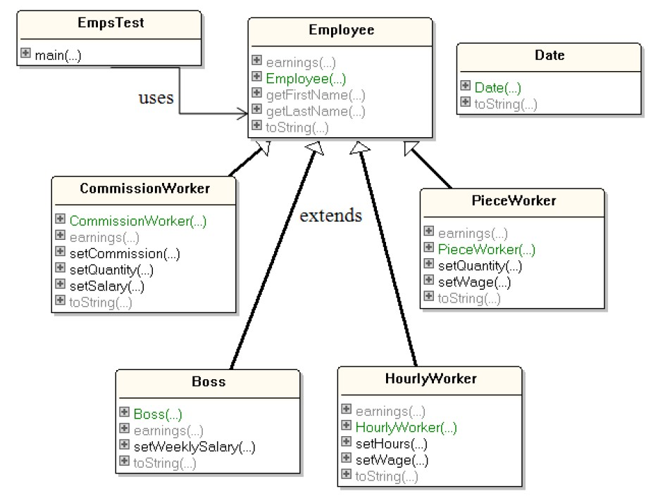

# Setup Java in VS Code

Before we getting start these with exercise, please setup Java in your editor. In this course, I recommend VS Code with Java Extensions.

## How to setup Java in VS Code

- [Java in Visual Studio Code](https://code.visualstudio.com/docs/languages/java)
- [Getting Started with Java in Visual Studio Code](https://code.visualstudio.com/docs/java/java-tutorial)

Download: [Installer of Visual Studio Code for Java developers](https://aka.ms/vscode-java-installer-win) with this link. Your VS Code should be able to work with Java properly. You might have to see link "Getting Started with Java in Visual Studo Code" above.

# Exercise 1.1: Hello.java

This exercise just use to verify that you have a proper installation of VS Code and Java Extensions and make sure that you can compile and run Java code for another exercise.

# Exercise 1.2: Stats.java

To do this exercise, you have to attend first 4 hours of lecture first. This exercise you have to implement a class called `Stats`, which generates statistics information. 

After a `Stats` object is created, doubles can be added to it using the `Stats.nextNumber()` method, as shown below:

```
Stats s = new Stats(); 
s.nextNumber(1.1); 
s.nextNumber(-2.4); 
s.nextNumber(0.8);`
```

`Stats` should include methods for the following:
- return the number of inputs (e.g. 3 for the example above);
- return the last number entered (e.g. 0.8 for the example above);
- return the sum of all the numbers entered (e.g. -0.5 for the example above);
- return the mean of all the numbers entered (e.g. -0.166667 (-0.5/3) for the example above);
- return the largest number entered (e.g. 1.1 for the example above)

Note that these methods can be called at any time, even if no numbers have been added to the `Stats` object with `nextNumber()`, and may be called again after more numbers have been added to the object.

**Important:** do **not** store all the number inputs in a data structure inside the `Stats` object. For example, do **not** use an array of doubles or an ArrayList to hold all the inputs

Write a short main() function that shows how `Stats` can be used.

b) Explain in words why it is a *good* idea to implement `Stats` without storing all the
numbers inputs in the object. Also, explain why it is a *bad* idea.

# Exercise 1.3: NumberedRandom.java

In this exercise, you have to use knowledge from *Modularization and Abstraction* class to achieve this exercise.

- Write a main() function and other static functions that use Java's Random class to
create an ArrayList of randomly generated integers, which have values
somewhere between -5 and 5. The program should finish by printing out a total of
all the integers. The number of integers is supplied by the user when prompted by
the program. Hint: use Java's Scanner class.

- Does part (a) have to use an ArrayList, or could an array be utilized? Explain your
answer in words.

## Hints
 - [Random class](https://docs.oracle.com/en/java/javase/14/docs/api/java.base/java/util/Random.html)
 - [Scanner class](https://docs.oracle.com/en/java/javase/14/docs/api/java.base/java/util/Scanner.html)

# Exercise 2:

The following questions use the Employee classes found in package `ex2`
The class diagrams for these classes are:



1. Add a private variable birthDate to the Employee class, using the Date class to represent the employee’s birthday. Employee output should now include the first and last names and birthday. Test this by modifying EmpsTest.java.

2. Add a new Employee subclass called Ajarn that represents an employee whose pay is based on the number of students in their class. The Ajarn class should contain private instance variables wage (to store the employee’s wage per student) and numStudents (to store their number of students). 
Implement earnings() in Ajarn, which calculates the employee’s earnings by multiplying the number of students by the wage per student. Test this by modifying EmpsTest.java.

3. Create an Employee array to store references to all the employees (i.e. a polymorphic data structure). List all the employees and their earnings by using a loop to iterate through the array. Test this by modifying EmpsTest.java.

Aside from copies of your code (Employee.java, EmpsTest.java, and Ajarn.java), your answers must include screenshots showing code compilation and output generated by EmpsTest.java on your machine. If your work does not include three screenshots (one for each question), then you will lose half marks.

Do not hand in copies of the CommissionWorker, Boss, HourlyWorker, PieceWorker, or Date classes which you do not need to be changed for these exercises.